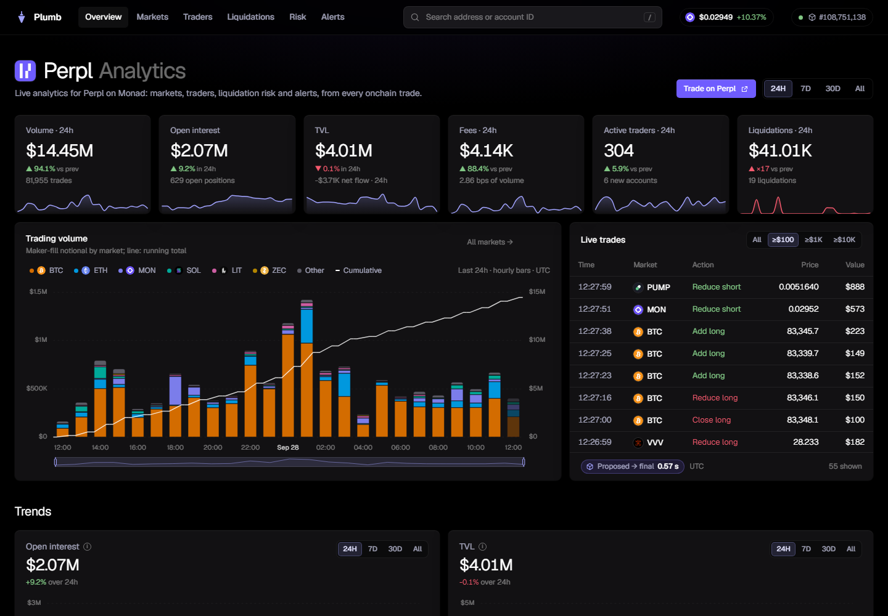
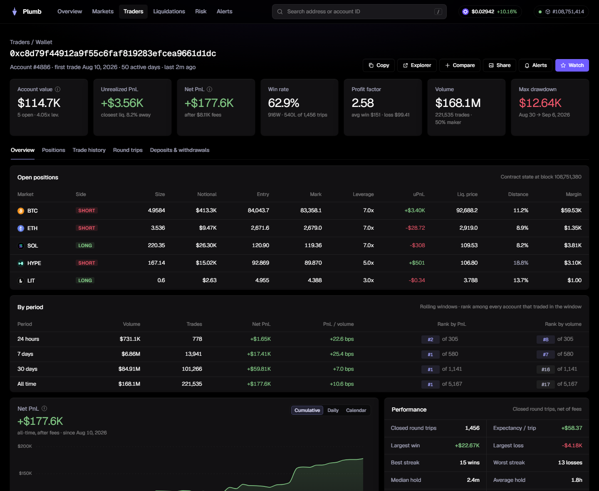

# Plumb

**Real-time analytics, risk data and alerts for [Perpl](https://perpl.xyz) on Monad.**

**[plumb.huginn.tech](https://plumb.huginn.tech)** · [API](docs/api.md) ·
[Features](docs/features.md) · [Methodology](docs/methodology.md)

[](https://github.com/s0urledd/plumb/actions/workflows/ci.yml)
[](LICENSE)



Perpl, the onchain perpetuals exchange on Monad, keeps every trade, position
and order onchain, but only as raw events and contract state. Plumb has its
own indexer that turns them into protocol totals, wallet histories and
liquidation risk. It has indexed every trade, position change, liquidation and
deposit since launch, reads the contract's live state, and runs about a second
behind the chain. Its data is also available through a public API.

It is for Perpl traders, and for builders who want the same data in their own
tools.

## What it does

- **Protocol.** Volume, open interest, TVL, fees, traders, deposits and
  withdrawals, and liquidations for 24h, 7d, 30d or all time, with charts by
  market and a live trade tape.
- **Markets.** A page per market: candles with the price levels where open
  positions would be liquidated, position flow, entry prices, funding, the
  order book and the largest positions.
- **Wallets and traders.** Search any address for open positions and
  liquidation prices, trade history, PnL, win rate, profit factor, drawdown,
  hold times and rank. Also leaderboards, cohorts by account size and track
  record, recent position changes of the top 50 traders by PnL, and
  side-by-side comparison.
- **Risk.** What a market-wide price move would liquidate and how much of
  that the order book could absorb, bad debt against each insurance fund, and
  a stress test. Perpl keeps positions and the order book in its contract, so
  these are worked out from the actual open positions and book depth.
- **Alerts.** A Telegram bot, [@PlumbPerplBot](https://t.me/PlumbPerplBot),
  for your wallets (every position change and warnings before liquidation),
  large liquidations and trades, and funding flips.

The full list is in [docs/features.md](docs/features.md).



## Data

| | |
| --- | --- |
| Network | Monad mainnet (chain 143) |
| Perpl exchange | [`0x34B6552d57a35a1D042CcAe1951BD1C370112a6F`](https://monadvision.com/address/0x34B6552d57a35a1D042CcAe1951BD1C370112a6F) |
| Collateral (AUSD) | [`0x00000000eFE302BEAA2b3e6e1b18d08D69a9012a`](https://monadvision.com/address/0x00000000eFE302BEAA2b3e6e1b18d08D69a9012a) |
| History | from block 54,773,010 (11 February 2026) |

Plumb deploys no contract of its own; it reads Perpl's contracts on Monad
mainnet. Two parts of it depend on Monad. Perpl can keep its whole order book
and every position in its contract, so risk and depth are read from contract
state instead of estimated. And with fast blocks and the node's execution
event stream, a trade shows on the tape while its block is still being
finalized.

Plumb's indexer reads Perpl's raw events from Monad over finalized blocks:
fills, position changes, funding, liquidations, deposits, withdrawals and
protocol transfers. It decodes them, links every position change to the fill
that settled it and stores them in ClickHouse with hourly rollups: more than
67 million events since launch. It follows new blocks as they finalize, and
when a new event type is added it reads that type back over the whole
history.

Next to the index:
- contract state (`eth_call` through Multicall3, at a pinned block): every
  open position, the order book, insurance funds and market parameters;
- the node's execution event stream, through a
  [Monode](https://github.com/monad-developers/monode) sidecar, for trades in
  blocks that are not final yet (shown on the live tape, never stored).

The market share section uses DefiLlama's figures and is labeled as such.

Accuracy:
- open interest, TVL and the protocol balance rebuilt from every event since
  launch are compared with the contract's own figures (`/api/v1/integrity`
  and the [status page](https://plumb.huginn.tech/#/status)); the protocol
  balance matched to the micro-dollar on 29 September 2026
  ([evidence](docs/evidence/protocol-balance-2026-09-29.json));
- every trade uses the price, size and fee of the fill that settled it;
- only finalized blocks count, and a window is marked partial until its
  history is complete;
- 24h volume was within 0.1% of Perpl's own figure in checks on 21, 23 and
  28 September 2026.

How each figure is computed: [methodology](docs/methodology.md).

## API

The dashboard's data is public: JSON, tables as CSV, and a server-sent event
stream of blocks, trades and liquidations.

```bash
curl -s 'https://plumb.huginn.tech/api/v1/protocol?window=7d' | jq .headline.volume
curl -s 'https://plumb.huginn.tech/api/v1/leaderboard?window=30d&by=pnl&limit=10'
curl -N  https://plumb.huginn.tech/api/v1/stream
# the largest BTC positions and how far each is from liquidation
curl -s 'https://plumb.huginn.tech/api/v1/markets/1/positions?limit=5' | jq '.positions[] | {account_id, side, notional, liquidation_distance_pct}'
```

Amounts are exact decimal strings (cohort totals are rounded), and every
response built from chain data carries the block it was computed at.
Reference: [docs/api.md](docs/api.md).

## How it works

```
  Monad node                                        Plumb (docker compose)
  ------------------------------                    ----------------------------------
  monad-rpc
    eth_getLogs (finalized blocks) ---------------> indexer    events -> ClickHouse
    eth_call (pinned block) ----------------------> collector  positions, book, risk
    WebSocket newHeads ---------------------------> wakes the indexer
  monad-execution
    execution event ring --> Monode sidecar ------> wakes the indexer; trades in
                                                    blocks not final yet (tape only)

                                                    ClickHouse events, hourly rollups
                                                    API        JSON, CSV, SSE
                                                    web/       dashboard
```

- **Indexer** follows the finalized head, decodes the exchange's events,
  links every position change to its fill and indexes the history from launch.
- **Collector** reads all open positions and the order book at a pinned block
  and works out margin, liquidation prices and stress figures in exact integer
  arithmetic.
- **ClickHouse** keeps the events and hourly rollups.
- **API** serves the dashboard and outside clients, with per-IP rate limits.

Stack: Node.js 22.9+, ClickHouse 26.8, plain JavaScript and Apache ECharts on
the front end (no build step), Docker Compose behind nginx.
More in [docs/architecture.md](docs/architecture.md).

## Run it

Needs Docker with Compose v2, and about 6 GB of disk for the full history.

```bash
git clone https://github.com/s0urledd/plumb && cd plumb
cp .env.example .env          # MONAD_RPC_URL, ARCHIVE_RPC_URLS, CLICKHOUSE_PASSWORD
docker compose up -d --build  # app + ClickHouse, then open http://127.0.0.1:8787
docker compose --profile exec-events up -d --build   # optional, with the node's event ring
```

No Monad node? Set both `MONAD_RPC_URL` and `ARCHIVE_RPC_URLS` to
`https://rpc1.monad.xyz`. It supports the 1000-block log ranges, finalized
blocks and `eth_call` that Plumb needs. It is rate-limited, so the backfill is
slower; set `BACKFILL_FROM_BLOCK` to index less history. `rpc.monad.xyz` does
not work: it limits log ranges to 100 blocks.

The live feed starts right away. With two archive RPCs, the history since
launch takes one to three hours to fill in. The [runbook](docs/runbook.md)
covers the reverse proxy, the event ring and the main settings.

```bash
npm ci && npm run check && npm test   # unit tests, no network needed
```

## Where to look in the code

- [`src/decode.js`](src/decode.js), [`src/ingest.js`](src/ingest.js): the
  indexer: decoding exchange events, linking each position change to its
  fill, following the chain and indexing the history.
- [`src/math.js`](src/math.js), [`src/metrics.js`](src/metrics.js): margin,
  liquidation prices and stress in the contract's own integer units.
- [`src/collector.js`](src/collector.js): contract state at a pinned block,
  kept in step with the chain and reconciled against the contract.
- [`src/live.js`](src/live.js): execution events through Monode and the live
  stream to the browser.
- [`src/alerts.js`](src/alerts.js): the Telegram bot.
- [`test/`](test): unit tests for the above, plus a ClickHouse integration
  test for the indexer (`npm run test:integration`, run in CI).

## After the hackathon

Huginn hosts Plumb and will keep running and developing it. Planned next:
webhook alerts alongside Telegram, and alerts on a market's liquidation
levels.

## Monad Metropolis

Entered in track 01, Onchain Finance & Trading, for Perpl's "Best Analytics /
Risk Tool" bounty. How the brief is covered:
[docs/submission.md](docs/submission.md).

## Credits

- Open source: viem, Apache ECharts, Geist, ClickHouse, Monode, and an ABI
  subset of Perpl's `perpl-sdk`. Market share figures from DefiLlama. Logos
  and icons belong to their owners. Licenses and sources:
  [docs/credits.md](docs/credits.md).
- We used an AI coding assistant to help write the code, tests and docs.
  The research, design, infrastructure, data validation and review are the
  team's own.

---

Built by the [Huginn](https://huginn.tech) team. Not affiliated with Perpl or
the Monad Foundation. [MIT](LICENSE).
